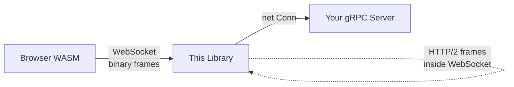
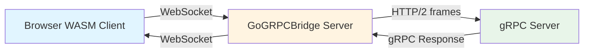
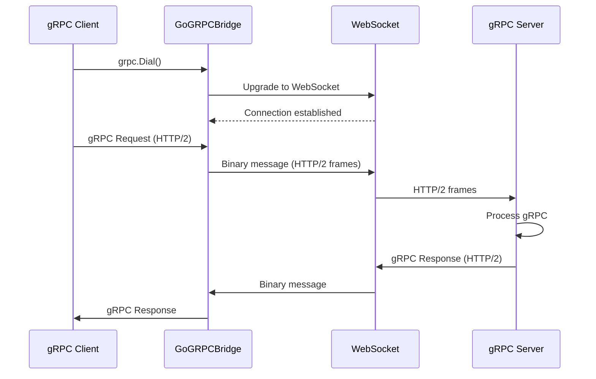
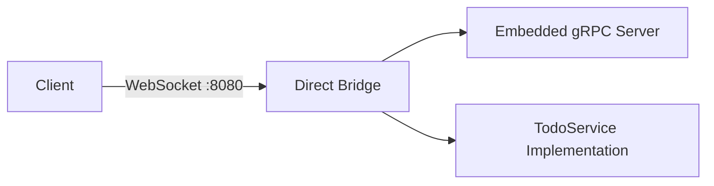

# grpc-tunnel

**Run native gRPC from web browsers.** This Go library tunnels gRPC calls through WebSocket connections, enabling full gRPC support (streaming, metadata, Protobuf) in browsers via WebAssembly—without gRPC-Web's limitations.

[](https://pkg.go.dev/github.com/monstercameron/grpc-tunnel)
[](https://goreportcard.com/report/github.com/monstercameron/grpc-tunnel)
[](https://github.com/monstercameron/grpc-tunnel/actions/workflows/build.yml)
[](https://github.com/monstercameron/grpc-tunnel/actions/workflows/test.yml)
[](https://opensource.org/licenses/MIT)
[](https://go.dev/)
[](https://github.com/monstercameron/grpc-tunnel/releases)

## Why This Exists

**The Problem:** Browsers can't make native gRPC calls because they lack HTTP/2 features that gRPC requires.

**What Browsers Can't Do:**
- ❌ HTTP/2 trailers (required for gRPC status codes)
- ❌ Bidirectional streaming over HTTP/2
- ❌ Access to HTTP/2 frames and flow control
- ❌ Send custom HTTP/2 headers for metadata
- ❌ HTTP/2 RST_STREAM for cancellation
- ❌ Direct control over HTTP/2 streams

**Common Solution:** gRPC-Web—but it's limited:
- ❌ No bidirectional streaming
- ❌ Requires special proxy (Envoy)
- ❌ Different wire format than real gRPC
- ❌ Incompatible with existing gRPC tools

**This Solution:** Tunnel real gRPC over WebSocket:
- ✅ Full gRPC support (all streaming modes, metadata)
- ✅ Works with any gRPC server (no special proxy)
- ✅ Native Protobuf efficiency
- ✅ Standard gRPC tooling compatible
- ✅ Firewall-friendly (WebSocket = HTTP upgrade)

**What This Enables in Browsers:**
- ✅ **Server streaming** - Live updates, real-time data feeds
- ✅ **Client streaming** - Upload streams, bulk operations
- ✅ **Bidirectional streaming** - Chat, collaborative editing, live sync
- ✅ **Metadata/Headers** - Authentication, tracing, custom headers
- ✅ **Trailers** - Status codes, error details, streaming metadata
- ✅ **Cancellation** - Proper cleanup, request abortion
- ✅ **Backpressure** - Flow control for large streams

## How It Works



The library wraps WebSocket as `net.Conn`, so gRPC thinks it's talking over a normal network connection. Zero protocol translation—just pure HTTP/2 frames tunneled through WebSocket.

## Quick Start

### Installation

```bash
go get github.com/monstercameron/grpc-tunnel
```

### Server (1 line)

```go
import "github.com/monstercameron/grpc-tunnel/pkg/grpctunnel"

grpcServer := grpc.NewServer()
proto.RegisterYourServiceServer(grpcServer, &yourImpl{})
grpctunnel.ListenAndServe(":8080", grpcServer)
```

### Client (Native Go)

```go
import "github.com/monstercameron/grpc-tunnel/pkg/grpctunnel"

conn, _ := grpctunnel.Dial("localhost:8080",
    grpc.WithTransportCredentials(insecure.NewCredentials()))
client := proto.NewYourServiceClient(conn)
```

### Client (Browser WASM)

```go
import "github.com/monstercameron/grpc-tunnel/pkg/grpctunnel"

// Automatic: Uses current page's host (https://example.com -> wss://example.com)
conn, _ := grpctunnel.Dial("",
    grpc.WithTransportCredentials(insecure.NewCredentials()))

// Or explicit URL:
conn, _ := grpctunnel.Dial("ws://localhost:8080",
    grpc.WithTransportCredentials(insecure.NewCredentials()))
client := proto.NewYourServiceClient(conn)
```

That's it. Full gRPC in browsers.

## Features

- 🎯 **Native gRPC** - All features work: unary, streaming (client/server/bidirectional), metadata
- 🚀 **Zero overhead** - Thin `net.Conn` wrapper, no protocol translation
- 🔌 **Simple API** - One function for server, one for client
- 🌐 **Browser ready** - WASM support for running gRPC directly in browsers
- 📦 **Minimal deps** - Only `gorilla/websocket` + standard gRPC
- 🧪 **Battle-tested** - Comprehensive test suite with race detection

## Detailed Architecture



### How It Works



The bridge provides transparent WebSocket transport for gRPC:
- **Client side**: gRPC → HTTP/2 frames → WebSocket binary messages
- **Server side**: WebSocket binary messages → HTTP/2 frames → gRPC

## Complete Examples

The repository includes several complete examples demonstrating different use cases:

### 1. Direct Bridge (`examples/direct-bridge`)

**What it demonstrates:** Self-contained gRPC server served directly over WebSocket



**Use case:** Single-process application that serves gRPC directly to WebSocket clients without a separate gRPC server

**Run it:**
```bash
go run examples/direct-bridge/main.go
```

### 2. Simple Bridge (`examples/simple-bridge`)

**What it demonstrates:** Minimal configuration for proxying to existing gRPC server

**Use case:** Quick setup to add WebSocket support to an existing gRPC server

**Run it:**
```bash
# Terminal 1: Start your gRPC server on :50051
go run examples/grpc-server/main.go

# Terminal 2: Start the bridge
go run examples/simple-bridge/main.go
```

### 3. Production Bridge (`examples/production-bridge`)

**What it demonstrates:** Full production configuration with:
- TLS/WSS support
- Origin validation
- Custom buffer sizes
- Connection lifecycle hooks
- Custom logging

**Use case:** Production-ready deployment with security and monitoring

**Run it:**
```bash
go run examples/production-bridge/main.go \
  -addr :8443 \
  -target localhost:50051 \
  -cert cert.pem \
  -key key.pem \
  -origins "https://yourdomain.com,https://app.yourdomain.com"
```

### 4. Custom Router (`examples/custom-router`)

**What it demonstrates:** Integrating bridge with existing HTTP server

**Use case:** Adding gRPC-over-WebSocket to an existing HTTP API server

**Run it:**
```bash
go run examples/custom-router/main.go
```

### 5. WASM Client (`examples/wasm-client`)

**What it demonstrates:** Browser-based gRPC client using WebAssembly

**Use case:** Making gRPC calls from web browsers

**Build & Run:**
```bash
# Build WASM
cd examples/wasm-client && bash build.sh

# Start server (any of the bridge examples)
go run examples/direct-bridge/main.go

# Open browser to examples/_shared/public/index.html
```

### 6. Standalone gRPC Server (`examples/grpc-server`)

**What it demonstrates:** Traditional gRPC server without WebSocket

**Use case:** Backend gRPC service that the bridge examples proxy to

**Run it:**
```bash
go run examples/grpc-server/main.go
```

## Configuration

### Server Options

```go
bridge.ServeHandler(bridge.ServerConfig{
    // Required
    GRPCServer: grpcServer,

    // Optional
    CheckOrigin: func(r *http.Request) bool {
        origin := r.Header.Get("Origin")
        return origin == "https://trusted.com"
    },
    ReadBufferSize:  8192,  // WebSocket read buffer (default: 4096)
    WriteBufferSize: 8192,  // WebSocket write buffer (default: 4096)
    OnConnect: func(r *http.Request) {
        log.Printf("Client connected: %s", r.RemoteAddr)
    },
    OnDisconnect: func(r *http.Request) {
        log.Printf("Client disconnected: %s", r.RemoteAddr)
    },
})
```

## Testing

Run the test suite:

```bash
# Quick pre-commit check (format + lint + tests)
make check

# Unit and integration tests
go test ./pkg/... -v -cover

# Unit tests with race detector
go test ./pkg/... -v -race

# E2E tests (requires Playwright)
go test ./e2e/... -v

# Fuzz tests
make fuzz

# Or run individual fuzzer
go test ./pkg/bridge -v -fuzz=FuzzWebSocketConnWrite -fuzztime=60s
```

**Test Coverage:** 85%+ with comprehensive unit, integration, fuzz, and e2e tests

## Development Workflow

### Before Committing

**Pre-commit hooks are automatically installed** to prevent commits with linting or formatting issues:

```bash
# Manual pre-commit check
make check

# Auto-format code
make fmt

# Run linter
make lint

# Auto-fix lint issues
make lint-fix
```

### CI/CD Pipeline

1. **Linting** - Code must pass `golangci-lint` with `.golangci.yml` config
2. **Formatting** - Code must be formatted with `gofmt`
3. **Tests** - All tests (unit, race, fuzz, e2e) must pass
4. **Security Scan** - Gosec scans for security issues (appears in GitHub Security tab)
   - Checks for SQL injection, hardcoded credentials, weak crypto, etc.
   - Informational only - doesn't block builds
5. **Auto-Release** - Only creates new release if all tests pass

### Security Scan

The `security` job in CI runs [Gosec](https://github.com/securego/gosec) to detect:
- SQL injection vulnerabilities
- Hardcoded credentials or tokens
- Weak cryptographic algorithms (MD5, SHA1, etc.)
- File path traversal issues  
- Unhandled errors that could cause security problems
- HTTP servers without timeouts
- Insecure file permissions

**SARIF** (Static Analysis Results Interchange Format) is a standard JSON format for security scan results. The scan uploads results as workflow artifacts for review.

**CI will FAIL** ❌ if high-severity issues with high confidence are detected (e.g., SQL injection, hardcoded secrets).

**CI will PASS** ✅ but log warnings for medium/low severity issues (e.g., unhandled errors, suboptimal permissions).

Current status: **Zero high-severity issues** - only 4 low-severity issues in auto-generated protobuf code.

## Production Checklist

- ✅ Use TLS (`wss://` instead of `ws://`)
- ✅ Set `CheckOrigin` to validate request origins
- ✅ Configure appropriate buffer sizes based on your payload
- ✅ Add monitoring via `OnConnect`/`OnDisconnect` hooks
- ✅ Implement rate limiting at the HTTP layer
- ✅ Use connection timeouts
- ✅ Handle graceful shutdown

## Performance Considerations

- **WebSocket Overhead**: Minimal framing overhead compared to raw TCP
- **Binary Efficiency**: Full Protobuf compression maintained
- **Concurrency**: Go routines handle multiple concurrent connections efficiently
- **Streaming**: Full support for unary, server streaming, client streaming, and bidirectional streaming

## Limitations

- **Not HTTP/2**: Uses WebSocket as transport, not standard gRPC HTTP/2
- **Firewall Traversal**: While WebSocket helps, some environments may still block it
- **No gRPC Reflection**: Standard gRPC tools don't work directly on WebSocket endpoint
- **Browser Only WASM**: WASM client code only runs in browsers, use native Go client otherwise

## License

MIT License - see LICENSE file for details
