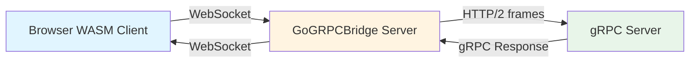
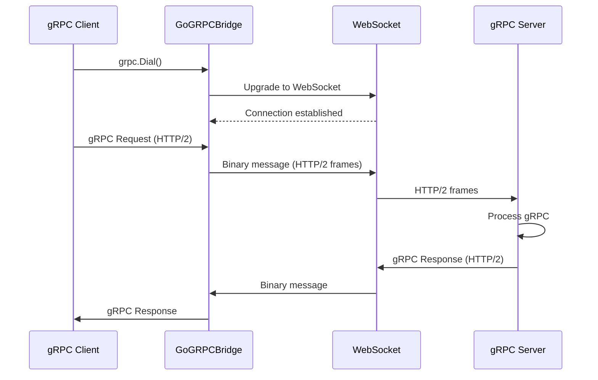
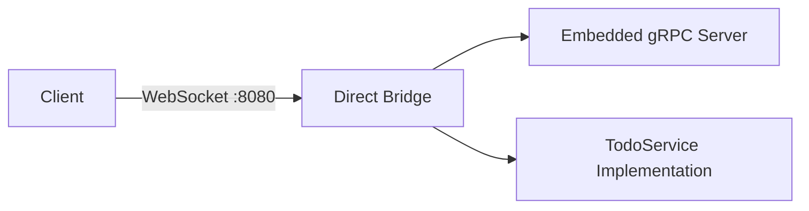

# GoGRPCBridge

A lightweight Go library that enables **direct gRPC communication over WebSocket**. Both client and server use this library to tunnel native gRPC calls through WebSocket connections, making gRPC accessible from browsers via WebAssembly.

[](https://pkg.go.dev/github.com/monstercameron/grpc-tunnel)
[](https://goreportcard.com/report/github.com/monstercameron/grpc-tunnel)

## Features

🎯 **Direct Communication** - No proxy server needed, client and server talk directly via WebSocket  
🚀 **Zero Overhead** - Thin wrapper around WebSocket as `net.Conn`, gRPC handles everything else  
🔌 **Simple API** - One function for client (`DialOption`), one for server (`ServeHandler`)  
🛡️ **Full gRPC Support** - Unary calls, streaming, metadata all work natively  
📦 **Minimal Dependencies** - Only `gorilla/websocket` + `google.golang.org/grpc`  
🧪 **Well Tested** - 98.2% test coverage with comprehensive unit and integration tests  
🌐 **Browser Ready** - WASM client support for running gRPC from web browsers

## Why gRPC over WebSocket?

- **Browser Compatibility** - Native gRPC requires HTTP/2 with features not fully supported in browsers
- **Firewall Friendly** - WebSocket connections (port 80/443) work through most corporate firewalls
- **No gRPC-Web** - Use native gRPC instead of the limited gRPC-Web protocol
- **End-to-End Binary** - Maintain Protobuf's efficiency throughout the entire stack

## Architecture



### How It Works



The bridge provides transparent WebSocket transport for gRPC:
- **Client side**: gRPC → HTTP/2 frames → WebSocket binary messages
- **Server side**: WebSocket binary messages → HTTP/2 frames → gRPC

## Quick Start

### Installation

```bash
go get github.com/monstercameron/grpc-tunnel
```

### Server Side

```go
package main

import (
    "log"
    "net/http"
    
    "google.golang.org/grpc"
    "github.com/monstercameron/grpc-tunnel/pkg/bridge"
    pb "your-project/proto"
)

func main() {
    // Create standard gRPC server
    grpcServer := grpc.NewServer()
    pb.RegisterYourServiceServer(grpcServer, &yourServiceImpl{})

    // Serve gRPC over WebSocket
    http.Handle("/", bridge.ServeHandler(bridge.ServerConfig{
        GRPCServer: grpcServer,
    }))

    log.Fatal(http.ListenAndServe(":8080", nil))
}
```

### Client Side (Native Go)

```go
package main

import (
    "context"
    
    "google.golang.org/grpc"
    "google.golang.org/grpc/credentials/insecure"
    "github.com/monstercameron/grpc-tunnel/pkg/bridge"
    pb "your-project/proto"
)

func main() {
    conn, _ := grpc.Dial(
        "localhost:8080",
        bridge.DialOption("ws://localhost:8080"),
        grpc.WithTransportCredentials(insecure.NewCredentials()),
    )
    defer conn.Close()

    client := pb.NewYourServiceClient(conn)
    resp, _ := client.YourMethod(context.Background(), &pb.Request{})
}
```

### Client Side (Browser WASM)

```go
//go:build js && wasm

package main

import (
    "context"
    
    "google.golang.org/grpc"
    "google.golang.org/grpc/credentials/insecure"
    "github.com/monstercameron/grpc-tunnel/pkg/wasm/dialer"
    pb "your-project/proto"
)

func main() {
    conn, _ := grpc.Dial(
        "localhost:8080",
        dialer.New("ws://localhost:8080"),
        grpc.WithTransportCredentials(insecure.NewCredentials()),
    )
    defer conn.Close()

    client := pb.NewYourServiceClient(conn)
    resp, _ := client.YourMethod(context.Background(), &pb.Request{})
}
```

## Examples

The repository includes several complete examples demonstrating different use cases:

### 1. Direct Bridge (`examples/direct-bridge`)

**What it demonstrates:** Self-contained gRPC server served directly over WebSocket



**Use case:** Single-process application that serves gRPC directly to WebSocket clients without a separate gRPC server

**Run it:**
```bash
go run examples/direct-bridge/main.go
```

### 2. Simple Bridge (`examples/simple-bridge`)

**What it demonstrates:** Minimal configuration for proxying to existing gRPC server

**Use case:** Quick setup to add WebSocket support to an existing gRPC server

**Run it:**
```bash
# Terminal 1: Start your gRPC server on :50051
go run examples/grpc-server/main.go

# Terminal 2: Start the bridge
go run examples/simple-bridge/main.go
```

### 3. Production Bridge (`examples/production-bridge`)

**What it demonstrates:** Full production configuration with:
- TLS/WSS support
- Origin validation
- Custom buffer sizes
- Connection lifecycle hooks
- Custom logging

**Use case:** Production-ready deployment with security and monitoring

**Run it:**
```bash
go run examples/production-bridge/main.go \
  -addr :8443 \
  -target localhost:50051 \
  -cert cert.pem \
  -key key.pem \
  -origins "https://yourdomain.com,https://app.yourdomain.com"
```

### 4. Custom Router (`examples/custom-router`)

**What it demonstrates:** Integrating bridge with existing HTTP server

```mermaid
graph TB
    A[HTTP :8080] --> B[/health]
    A --> C[/metrics]
    A --> D[/grpc - Bridge 1]
    A --> E[/api/v2/grpc - Bridge 2]
    D --> F[gRPC Server :50051]
    E --> G[gRPC Server :50052]
```

**Use case:** Adding gRPC-over-WebSocket to an existing HTTP API server

**Run it:**
```bash
go run examples/custom-router/main.go
```

### 5. WASM Client (`examples/wasm-client`)

**What it demonstrates:** Browser-based gRPC client using WebAssembly

**Use case:** Making gRPC calls from web browsers

**Build & Run:**
```bash
# Build WASM
cd examples/wasm-client && bash build.sh

# Start server (any of the bridge examples)
go run examples/direct-bridge/main.go

# Open browser to examples/_shared/public/index.html
```

### 6. Standalone gRPC Server (`examples/grpc-server`)

**What it demonstrates:** Traditional gRPC server without WebSocket

**Use case:** Backend gRPC service that the bridge examples proxy to

**Run it:**
```bash
go run examples/grpc-server/main.go
```

## Configuration

### Server Options

```go
bridge.ServeHandler(bridge.ServerConfig{
    // Required
    GRPCServer: grpcServer,

    // Optional
    CheckOrigin: func(r *http.Request) bool {
        origin := r.Header.Get("Origin")
        return origin == "https://trusted.com"
    },
    ReadBufferSize:  8192,  // WebSocket read buffer (default: 4096)
    WriteBufferSize: 8192,  // WebSocket write buffer (default: 4096)
    OnConnect: func(r *http.Request) {
        log.Printf("Client connected: %s", r.RemoteAddr)
    },
    OnDisconnect: func(r *http.Request) {
        log.Printf("Client disconnected: %s", r.RemoteAddr)
    },
})
```

## Testing

Run the test suite:

```bash
# Unit and integration tests
go test ./pkg/bridge/... -v -cover

# E2E tests (requires Playwright)
cd e2e && go test -v
```

**Test Coverage:** 98.2% with comprehensive unit and integration tests

## Production Checklist

- ✅ Use TLS (`wss://` instead of `ws://`)
- ✅ Set `CheckOrigin` to validate request origins
- ✅ Configure appropriate buffer sizes based on your payload
- ✅ Add monitoring via `OnConnect`/`OnDisconnect` hooks
- ✅ Implement rate limiting at the HTTP layer
- ✅ Use connection timeouts
- ✅ Handle graceful shutdown

## Performance Considerations

- **WebSocket Overhead**: Minimal framing overhead compared to raw TCP
- **Binary Efficiency**: Full Protobuf compression maintained
- **Concurrency**: Go routines handle multiple concurrent connections efficiently
- **Streaming**: Full support for unary, server streaming, client streaming, and bidirectional streaming

## Limitations

- **Not HTTP/2**: Uses WebSocket as transport, not standard gRPC HTTP/2
- **Firewall Traversal**: While WebSocket helps, some environments may still block it
- **No gRPC Reflection**: Standard gRPC tools don't work directly on WebSocket endpoint
- **Browser Only WASM**: WASM client code only runs in browsers, use native Go client otherwise

## License

MIT License - see LICENSE file for details
