# GoGRPCBridge

**Bring the power of gRPC to your web browser.** 

Stop fighting with REST endpoints, JSON serialization, and HTTP polling. Use real gRPC with bidirectional streaming, type-safe Protobuf messages, and efficient binary protocols—directly from your browser via WebAssembly.

[](https://pkg.go.dev/github.com/monstercameron/GoGRPCBridge)
[](https://goreportcard.com/report/github.com/monstercameron/GoGRPCBridge)
[](https://github.com/monstercameron/GoGRPCBridge/actions/workflows/build.yml)
[](https://github.com/monstercameron/GoGRPCBridge/actions/workflows/test.yml)
[](https://opensource.org/licenses/MIT)
[](https://go.dev/)
[](https://github.com/monstercameron/GoGRPCBridge/releases)

---

## 🎯 Why You Need This

Building modern web applications means choosing between developer experience and user experience. REST gives you browser compatibility but loses type safety, streaming, and efficiency. gRPC gives you everything except browser support.

**Until now.**

GoGRPCBridge tunnels native gRPC through WebSocket, giving you:

### What You Get

✅ **Real-time bidirectional streaming** - Build chat apps, live dashboards, and collaborative tools without HTTP polling  
✅ **Type-safe contracts** - Your Protobuf definitions work across frontend and backend  
✅ **4-8x smaller payloads** - Binary Protobuf vs JSON  
✅ **No REST boilerplate** - Stop writing serializers, validators, and HTTP handlers  
✅ **Standard gRPC tooling** - Use protoc, grpc-gateway, and existing libraries  
✅ **One codebase** - Same gRPC services for web, mobile, and backend microservices

### What gRPC-Web Can't Do (But We Can)

| Feature | gRPC-Web | GoGRPCBridge |
|---------|----------|--------------|
| Bidirectional streaming | ❌ | ✅ |
| Works with any gRPC server | ❌ Needs Envoy | ✅ |
| Zero protocol translation | ❌ | ✅ |
| Standard HTTP/2 frames | ❌ | ✅ |
| Firewall friendly | ✅ | ✅ |

---

## 🚀 Get Started in 60 Seconds

### 1. Install

```bash
go get github.com/monstercameron/GoGRPCBridge
```

### 2. Define Your Service (Protobuf)

```protobuf
syntax = "proto3";

service ChatService {
  // Bidirectional streaming - impossible with REST!
  rpc LiveChat(stream ChatMessage) returns (stream ChatMessage);
  
  // Server streaming - real-time updates
  rpc SubscribeToUpdates(SubscribeRequest) returns (stream Update);
}

message ChatMessage {
  string user = 1;
  string message = 2;
  int64 timestamp = 3;
}
```

**Why Protobuf?**
- 🔒 Type safety prevents runtime errors
- 📦 4-8x smaller than JSON (binary encoding)
- ⚡ 2-3x faster serialization
- 🔄 Backward/forward compatible
- 📝 Auto-generated code for 11+ languages

### 3. Server Setup (One Function Call)

```go
package main

import (
    "github.com/monstercameron/GoGRPCBridge/pkg/grpctunnel"
    "google.golang.org/grpc"
)

func main() {
    // Your existing gRPC server
    grpcServer := grpc.NewServer()
    proto.RegisterChatServiceServer(grpcServer, &chatServiceImpl{})
    
    // That's it - gRPC is now accessible via WebSocket
    grpctunnel.ListenAndServe(":8080", grpcServer)
}
```

### 4. Browser Client (WebAssembly)

```go
package main

import (
    "context"
    "github.com/monstercameron/GoGRPCBridge/pkg/grpctunnel"
    "google.golang.org/grpc"
)

func main() {
    // Automatically uses current page's host
    conn, _ := grpctunnel.Dial("", 
        grpc.WithTransportCredentials(insecure.NewCredentials()))
    
    client := proto.NewChatServiceClient(conn)
    
    // Full bidirectional streaming in the browser!
    stream, _ := client.LiveChat(context.Background())
    stream.Send(&proto.ChatMessage{User: "Alice", Message: "Hello!"})
    response, _ := stream.Recv()
}
```

**Build for WASM:**
```bash
GOOS=js GOARCH=wasm go build -o main.wasm
```

---

## 💡 Why gRPC Changes Everything

### The Problem with REST

```javascript
// REST: Manual serialization, no streaming, polling for updates
fetch('/api/messages', {
  method: 'POST',
  body: JSON.stringify({ user: 'Alice', message: 'Hello' })
})
.then(r => r.json())
.then(data => {
  // Poll every second for new messages 😞
  setInterval(() => fetch('/api/messages').then(...), 1000)
})
```

**Issues:**
- ❌ No type safety (runtime errors from typos)
- ❌ HTTP polling wastes bandwidth and delays updates
- ❌ Manual JSON serialization prone to errors
- ❌ No streaming (upload/download must complete)
- ❌ Different API for each platform

### The gRPC Way

```go
// gRPC: Type-safe, bidirectional, real-time
stream, _ := client.LiveChat(ctx)

// Send messages
go func() {
    stream.Send(&proto.ChatMessage{
        User: "Alice",
        Message: "Hello",
    })
}()

// Receive in real-time (no polling!)
for {
    msg, _ := stream.Recv()
    fmt.Printf("%s: %s\n", msg.User, msg.Message)
}
```

**Benefits:**
- ✅ Compiler catches typos and type errors
- ✅ Real-time bidirectional streaming
- ✅ Auto-generated serialization (Protobuf)
- ✅ Efficient binary protocol (4-8x smaller)
- ✅ Same service definition for web, mobile, backend

### Real-World Impact

**Chat Application:**
- REST: Poll every 1s = 3,600 requests/hour per user
- gRPC: 1 persistent connection = instant delivery

**Large Dataset (1MB):**
- JSON: ~1,000 KB
- Protobuf: ~250 KB (75% reduction)

**Development Time:**
- REST: Write serializers, validators, HTTP handlers for each endpoint
- gRPC: `protoc` generates everything from one .proto file

---

## 📚 Getting Started Guide

### Step 1: Define Your API Contract

Create `api/service.proto`:

```protobuf
syntax = "proto3";
option go_package = "myapp/proto";

service TodoService {
  rpc CreateTodo(CreateTodoRequest) returns (Todo);
  rpc ListTodos(ListTodosRequest) returns (stream Todo);  // Server streaming!
  rpc SyncTodos(stream Todo) returns (stream Todo);       // Bidirectional!
}

message Todo {
  string id = 1;
  string text = 2;
  bool done = 3;
}
```

**Generate code:**
```bash
protoc --go_out=. --go-grpc_out=. api/service.proto
```

### Step 2: Implement Your Service

```go
type todoServer struct {
    proto.UnimplementedTodoServiceServer
    todos []*proto.Todo
}

func (s *todoServer) CreateTodo(ctx context.Context, req *proto.CreateTodoRequest) (*proto.Todo, error) {
    todo := &proto.Todo{
        Id:   uuid.New().String(),
        Text: req.Text,
        Done: false,
    }
    s.todos = append(s.todos, todo)
    return todo, nil
}

func (s *todoServer) ListTodos(req *proto.ListTodosRequest, stream proto.TodoService_ListTodosServer) error {
    // Server streaming - send todos as they're ready
    for _, todo := range s.todos {
        if err := stream.Send(todo); err != nil {
            return err
        }
    }
    return nil
}
```

### Step 3: Start Your Server

```go
func main() {
    grpcServer := grpc.NewServer()
    proto.RegisterTodoServiceServer(grpcServer, &todoServer{})
    
    // Bridge makes it accessible via WebSocket
    grpctunnel.ListenAndServe(":8080", grpcServer)
}
```

### Step 4: Build Your WASM Client

```go
//go:build js && wasm

package main

import (
    "context"
    "github.com/monstercameron/GoGRPCBridge/pkg/grpctunnel"
    "google.golang.org/grpc"
)

func main() {
    conn, _ := grpctunnel.Dial("", grpc.WithInsecure())
    client := proto.NewTodoServiceClient(conn)
    
    // Create todo
    todo, _ := client.CreateTodo(context.Background(), &proto.CreateTodoRequest{
        Text: "Learn gRPC",
    })
    
    // Stream todos in real-time
    stream, _ := client.ListTodos(context.Background(), &proto.ListTodosRequest{})
    for {
        todo, err := stream.Recv()
        if err != nil {
            break
        }
        println(todo.Text)
    }
}
```

```bash
GOOS=js GOARCH=wasm go build -o app.wasm
```

### Step 5: Serve Your WASM App

```html
<!DOCTYPE html>
<html>
<head>
    <script src="wasm_exec.js"></script>
    <script>
        const go = new Go();
        WebAssembly.instantiateStreaming(fetch("app.wasm"), go.importObject)
            .then(result => go.run(result.instance));
    </script>
</head>
<body>
    <h1>gRPC in the Browser!</h1>
    <!-- Your WASM app runs here -->
</body>
</html>
```

**That's it!** You now have type-safe, streaming gRPC running in the browser.

---

## 🔥 Ready to Build Something Amazing?

### [⭐ Star this repo](https://github.com/monstercameron/GoGRPCBridge) to stay updated

### [📖 Explore Full Examples](./examples/) - Production-ready code for every use case

### [💬 Join Discussions](https://github.com/monstercameron/GoGRPCBridge/discussions) - Get help and share your projects

### [🐛 Report Issues](https://github.com/monstercameron/GoGRPCBridge/issues) - Help us improve

---

## 🏗️ Production Examples

The `examples/` directory contains complete, runnable applications demonstrating real-world usage:

| Example | Use Case | Key Features |
|---------|----------|--------------|
| **direct-bridge** | All-in-one server | Embedded gRPC + WebSocket in single process |
| **production-bridge** | Enterprise deployment | TLS, origin validation, monitoring hooks |
| **custom-router** | Hybrid HTTP/gRPC API | Integrate with existing HTTP servers |
| **wasm-client** | Browser application | Full WASM client with streaming |
| **grpc-server** | Backend service | Standard gRPC server example |

[**View all examples →**](./examples/)

---

## 🛡️ Battle-Tested

- ✅ 85%+ test coverage
- ✅ Race detector clean
- ✅ Fuzz tested (4 billion+ inputs)
- ✅ E2E browser tests (Playwright)
- ✅ Zero high-severity security issues
- ✅ Production-ready configuration examples

---

## 📊 Benchmarks

*Coming soon - PR welcome!*

---

## 🤝 Contributing

We welcome contributions! See [CONTRIBUTING.md](./CONTRIBUTING.md) for:
- Development workflow
- Pre-commit hooks
- Testing guidelines
- Security scan details

---

## 📜 License

MIT License - Build commercial and open-source projects freely.

---

## 🌟 Support This Project

If GoGRPCBridge helps your project, please:
- ⭐ **Star this repository**
- 🐦 **Share on social media**
- 💬 **Tell your team**
- 🙏 **Contribute improvements**

**Built with ❤️ by developers, for developers.**

---

## 🏗️ Production Examples

The `examples/` directory contains complete, runnable applications demonstrating real-world usage:

| Example | Use Case | Key Features |
|---------|----------|--------------|
| **direct-bridge** | All-in-one server | Embedded gRPC + WebSocket in single process |
| **production-bridge** | Enterprise deployment | TLS, origin validation, monitoring hooks |
| **custom-router** | Hybrid HTTP/gRPC API | Integrate with existing HTTP servers |
| **wasm-client** | Browser application | Full WASM client with streaming |
| **grpc-server** | Backend service | Standard gRPC server example |

[**View all examples →**](./examples/)

---

## ⚙️ Advanced Configuration

### Server Options

```go
import "github.com/monstercameron/GoGRPCBridge/pkg/grpctunnel"

server := &http.Server{
    Addr: ":8443",
    Handler: grpctunnel.Wrap(grpcServer,
        // Validate request origins (CORS)
        grpctunnel.WithOriginCheck(func(r *http.Request) bool {
            origin := r.Header.Get("Origin")
            return origin == "https://yourdomain.com"
        }),
        
        // Connection lifecycle hooks
        grpctunnel.WithConnectHook(func(r *http.Request) {
            log.Printf("Client connected: %s", r.RemoteAddr)
        }),
        grpctunnel.WithDisconnectHook(func(r *http.Request) {
            log.Printf("Client disconnected: %s", r.RemoteAddr)
        }),
        
        // Custom WebSocket buffer sizes
        grpctunnel.WithReadBufferSize(16384),
        grpctunnel.WithWriteBufferSize(16384),
    ),
    
    // Security timeouts
    ReadTimeout:  15 * time.Second,
    WriteTimeout: 15 * time.Second,
    IdleTimeout:  60 * time.Second,
}

// TLS for production
server.ListenAndServeTLS("cert.pem", "key.pem")
```

### Production Checklist

- ✅ Use TLS (`wss://` instead of `ws://`)
- ✅ Set `CheckOrigin` to validate request origins
- ✅ Configure HTTP timeouts (ReadTimeout, WriteTimeout, IdleTimeout)
- ✅ Add monitoring via connection hooks
- ✅ Implement rate limiting at the HTTP layer
- ✅ Use appropriate buffer sizes for your payload sizes
- ✅ Handle graceful shutdown

---

## 🛡️ Battle-Tested

- ✅ **85%+ test coverage** - Comprehensive unit and integration tests
- ✅ **Race detector clean** - Zero data races in concurrent code
- ✅ **Fuzz tested** - 4 billion+ inputs across 4 fuzzers
- ✅ **E2E browser tests** - Playwright-based end-to-end validation
- ✅ **Zero high-severity security issues** - Gosec scans on every commit
- ✅ **Production examples** - Real-world configurations included

### Run Tests Yourself

```bash
# Quick check (format + lint + tests)
make check

# Unit tests with coverage
go test ./pkg/... -cover

# Race detection
go test ./pkg/... -race

# Fuzz testing
make fuzz
```

---

## 📖 How It Works

```mermaid
sequenceDiagram
    participant Client as gRPC Client (WASM)
    participant Bridge as GoGRPCBridge
    participant WS as WebSocket
    participant Server as gRPC Server
    
    Client->>Bridge: grpc.Dial()
    Bridge->>WS: Upgrade HTTP → WebSocket
    WS-->>Bridge: Connection established
    
    Client->>Bridge: gRPC Request
    Bridge->>WS: HTTP/2 frames → Binary messages
    WS->>Server: Binary messages → HTTP/2 frames
    Server->>Server: Process gRPC call
    Server->>WS: gRPC Response (HTTP/2)
    WS->>Bridge: Binary messages
    Bridge->>Client: HTTP/2 frames → gRPC Response
```



**Key Insight:** The bridge provides a transparent `net.Conn` interface backed by WebSocket. gRPC doesn't know it's using WebSocket—it thinks it's a normal TCP connection.

---

## 🚧 Limitations & Tradeoffs

| Aspect | Status | Notes |
|--------|--------|-------|
| **HTTP/2 Native** | ❌ | Uses WebSocket transport, not standard gRPC HTTP/2 |
| **gRPC Reflection** | ❌ | Standard tools don't work on WebSocket endpoints |
| **Firewall Traversal** | ⚠️ | Better than HTTP/2, but some proxies may block WebSocket |
| **Browser Requirement** | ✅ | WASM client only works in browsers (use native Go otherwise) |
| **Performance** | ✅ | Minimal overhead; binary Protobuf maintained |
| **Tooling** | ⚠️ | Can't use `grpcurl` or `grpcui` directly on bridge endpoint |

---

## License

MIT License - see LICENSE file for details
